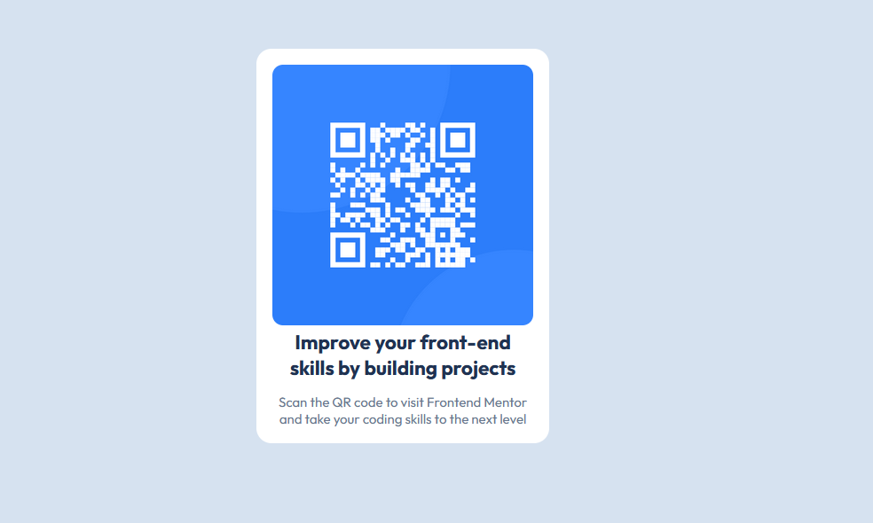

# Frontend Mentor - QR code component solution

## Table of contents

- [Overview](#overview)
  - [Screenshot](#screenshot)
  - [Links](#links)
- [My process](#my-process)
  - [Built with](#built-with)
  - [What I learned](#what-i-learned)
  - [Continued development](#continued-development)
- [Author](#author)

## Overview

### Screenshot

### Links
- Live Site URL: (https://chandanakandambi.github.io/my-new-project/)

## My process

### Built with

- Semantic HTML5 markup
- CSS custom properties
- Flexbox

### What I learned

I got an overall review of html and css and could apply my knowledge. I learned how to center a container, stops overflowing an image and the usage of classes in the stylesheet

### Continued development

I realised that I needed more practise using css, being familiarised with common attributes and page settings. I was stuck in centering the container as I had only a primary knowledge of flexbox. I understood the need of more practise in using flexbox.

## Author

- Github - Chandana Kandambi (https://github.com/ChandanaKandambi/)
